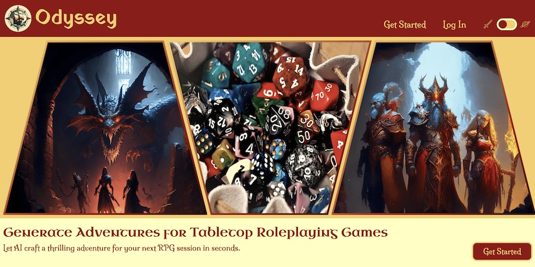
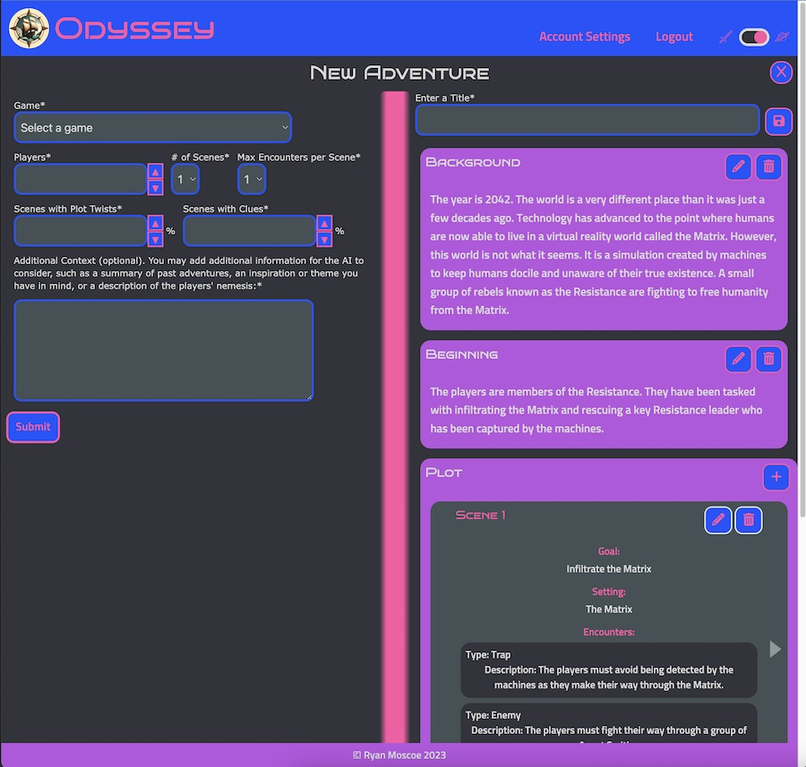
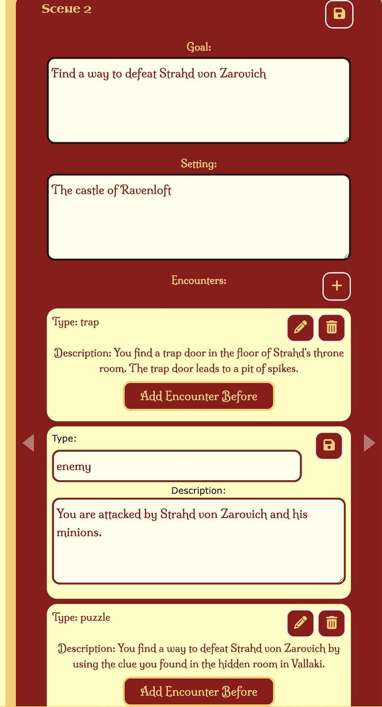
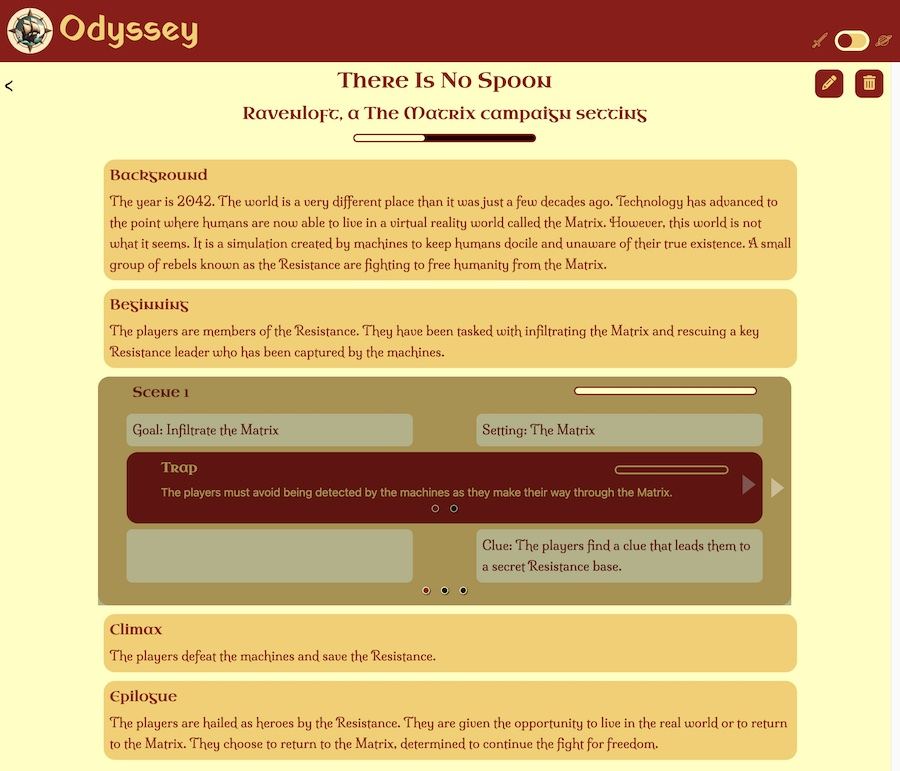
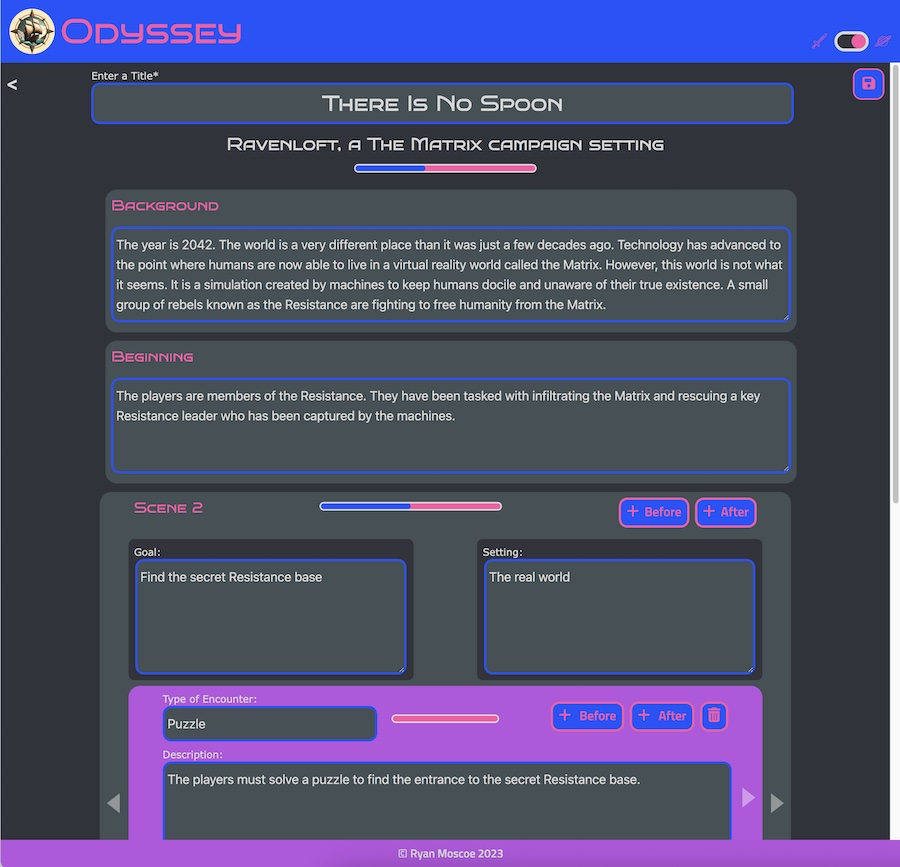
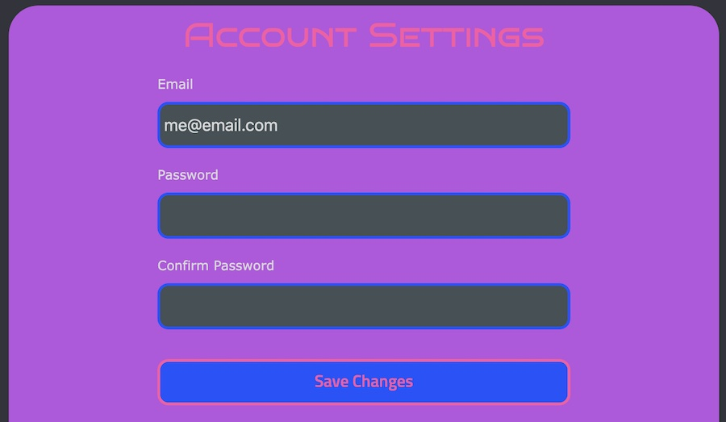

# Odyssey

## Table of Contents

- [Table of Contents](#table-of-contents)
- [Description](#description)
- [Technology Used](#technology-used)
  - [Badges](#badges)
- [Code Examples](#code-examples)
  - [Back End](#back-end)
  - [Front End](#front-end)
- [AI Prompt Example](#ai-prompt-example)
- [Usage](#usage)
  - [Getting Started](#getting-started)
  - [Logging In](#logging-in)
  - [My Adventures](#my-adventures)
  - [Generating an Adventure](#generating-an-adventure)
  - [Adventure Details](#adventure-details)
  - [Account Management](#account-management)
- [Process and Lessons Learned](#process-and-lessons-learned)
  - [Analysis and User Stories](#analysis-and-user-stories)
  - [Design, Technology Selection, and AI Prompt Development](#design-technology-selection-and-ai-prompt-development)
  - [Project Planning and Success Criteria](#project-planning-and-success-criteria)
  - [Development](#development)
- [Author Info](#author-info)
  - [Ryan Moscoe](#ryan-moscoe)
- [Features](#features)
- [Future Development](#future-development)
- [License](#license)
- [Contributing](#contributing)

<br/>

## Description 

[Visit the Deployed Site](https://odyssey-d4b3f26536d0.herokuapp.com/)

Writing adventures is time-consuming, and players often make unanticipated choices, forcing game masters to improvise and abandon the preparations they spent so much time creating. What game masters need is a way to create a customized adventure quickly.

Odyssey uses the Google PaLM2 generative AI to craft thrilling adventures for tabletop roleplaying games in seconds. Choose from a large selection of the most popular games, enter a lesser-known title, or describe an unpublished/homebrew game. Refine your request with a campaign setting, number of players, experience level, and other parameters.

If desired, fine-tune the adventure by editing it, then save it so you can refer to it over the course of multiple game sessions. View the details of any of your saved adventures, and edit saved adventures to adapt to your players' choices. Odyssey also tracks the group's progress through the adventure.

Odyssey is built with Python/Django for the back end and TypeScript, React, and TailwindCSS for the front end. It uses PaLM2 and Gencraft generative AIs, and it has a MySQL database.



_____

<br/>

## Technology Used 

| Technology  | Description                                                                                        | Resource URL                                                                                         |
| ----------- | -------------------------------------------------------------------------------------------------- | ---------------------------------------------------------------------------------------------------- |
| MySQL       | Relational database                                                                                | [https://www.mysql.com/](https://www.mysql.com/)                                                     |
| Python      | Programming language often used with AI and machine learning                                       | [https://www.python.org/](https://www.python.org/)                                                   |
| Django      | Web development framework for Python                                                               | [https://www.djangoproject.com/](https://www.djangoproject.com/)                                     |
| PaLM2       | Large language model (LLM) generative AI                                                           | [https://ai.google/discover/palm2/](https://ai.google/discover/palm2/)                               |
| Gencraft    | AI image generator                                                                                 | [https://gencraft.com/](https://gencraft.com/)                                                       |
| Vite        | Build tool that aims to provide a faster and leaner development experience for modern web projects | [https://vitejs.dev/](https://vitejs.dev/)                                                           |
| TypeScript  | Strongly typed variant of the JavaScript programming language                                      | [https://www.typescriptlang.org/](https://www.typescriptlang.org/)                                   |
| React       | Web interface library                                                                              | [https://react.dev/](https://react.dev/)                                                             |
| CSS         | Programming language for styling web pages                                                         | [https://developer.mozilla.org/en-US/docs/Web/CSS](https://developer.mozilla.org/en-US/docs/Web/CSS) |
| TailwindCSS | Utility-first CSS framework                                                                        | [https://tailwindcss.com/](https://tailwindcss.com/)                                                 |
| Git         | Version control system                                                                             | [https://git-scm.com/](https://git-scm.com/)                                                         |
| Github      | Development platform featuring remote repositories                                                 | [https://github.com/](https://github.com/)                                                           |
| Heroku      | Cloud platform as a service (PaaS)                                                                 | [https://www.heroku.com/home](https://www.heroku.com/home)                                           |

<br/>

### Badges

  &nbsp; &nbsp;     &nbsp; &nbsp;      &nbsp; &nbsp;     &nbsp; &nbsp;  

-----

<br/>

## Code Examples

### Back End

In Django, a view is an action or set of actions that occurs when a particular URL is accessed. The view below is triggered by a POST request to the `api/generate-adventure/` URL. The login_required_ajax decorator invokes a custom function to ensure the user is logged in before running the rest of the code.

```python
class GenerateAdventureView(APIView):
    @login_required_ajax
    def post(self, request):
        try:
            data = request.data
            campaign_setting = data.get("campaign_setting")
            level = data.get("level")
            experience = data.get("experience")
            context = data.get("context")

            adventure = generate_adventure(data["game"], data["players"], data["scenes"], data["encounters"], data["plot_twists"], data["clues"], campaign_setting, level, experience, context).strip('"```json\\n').rstrip('\\n```"')

            adventure_dict = json.loads(adventure)
            serialized_adventure = json.dumps(adventure_dict)

            return HttpResponse(serialized_adventure, content_type="application/json")
        except Exception as e:
            print("Unable to generate adventure because %s" % e)
            return Response({'error': 'Something went wrong when generating adventure'}, status=500)
```

<br/>

### Front End

The Adventure Details page includes the saveAdventure() function below. Saving changes to an adventure is a complex process, because the adventure includes certain details (e.g. a title and an exposition) but also has a one-to-many relationship with zero or more Scene objects. Each Scene, in turn, has a one-to-many relationship with zero or more Encounter objects. In addition, Scenes and Encounters can be added while editing the adventure. As a result, some scenes and encounters may already exist in the database, whereas others may not.

The saveAdventure() function sets the complex process of saving changes to an adventure (and its scenes and encounters) in motion.
1. It sets the `loading` state variable to true, which renders a spinner.
2. It validates the field values.
3. It assembles the payload for the API call to update the adventure in the database.
4. It makes an asynchronous call to the server (back end) to update the adventure in the database. In order to do so, it must pass a CSRF Token in the headers, which is a Django security measure.
5. It updates the `adventure` state variable so the adventure details can be rerendered with the updated values.
6. It sets the `saveScene` state variable to true. This variable is passed as a prop to the Scene components and causes each scene to invoke a function to save its updates to the database via a useEffect hook.

Similarly, When each scene completes its API call to update itself in the database, it sets a state variable that is passed as a prop to each Encounter object, causing each Encounter to save itself to the database. When each encounter completes its API call, it increments a state variable at the Scene level. Each Scene increments another state variable on the Adventure Details page when all encounters for that scene have been saved. The last Scene to report that all encounters have been saved resets the state variables involved in saving the adventure, scenes, and encounters. It also sets `loading` to false so the spinner is no longer rendered.

```typescript
    const saveAdventure = async () => {
        setLoading(true);

        // Validate
        setNotification("Validating");
        if (titleText === '') {
            setNotification("Title is required");
            titleInputRef.current?.classList.add("invalid-entry");
            setLoading(false);
            return;
        }
        if (expositionText.length > 499) {
            setNotification("Background exceeds character limit.");
            expositionRef && expositionRef.current?.classList.add("invalid-entry");
            setLoading(false);
            return;
        }

        // assemble Adventure
        setNotification("Saving adventure");
        const adventurePayload = {
            title: titleText,
            exposition: expositionRef.current?.innerText || expositionText,
            incitement: incitementText,
            climax: climaxText,
            denoument: denoumentText
        }

        try {
            // save Adventure
            const response = await axios.patch(`/api/adventures/${id}/`, adventurePayload, { headers: { 'X-CSRFToken': Cookies.get('csrftoken') } });

            if (response.status === 401) {
                navigate('/login');
            } else if (response.data) {
                setAdventure(response.data);
                setSaveComplete(false);
                if (scenes) {
                    resetScenesSaved();
                }
                setSaveScene(true);
            } else {
                setNotification('Oops! Something went wrong. Please try again.');
            }
        } catch (err) {
            console.error(err);
            setNotification("Oops! Something went wrong. Please try again.");
            setLoading(false);
        }
    }
```

Whereas the previous code example shows how certain functionality was achieved with TypeScript and React, the following example shows how a portion of the structure of the Adventure Details page was built with TypeScript and JSX, which is a syntax extension for JavaScript used for writing markup similar to HTML within a JavaScript (or TypeScript) file. This section of markup contains several noteworthy elements:
* The CSRFToken is a custom React component responsible for obtaining a CSRF Token from the server and storing it on the client side as a cookie. All mutating API requests (create, update, or delete) to a Django server must pass a CSRF Token.
* Other custom components shown include the Stage, Carousel, and SceneDetails components.
* Carousel functionality is particularly difficult to execute well. I tried three different libraries before finding success with react-responsive-carousel.
* The scenes array is mapped onto the SceneDetails component, so that one SceneDetails component is rendered for each scene in the adventure. Each SceneDetails component functions as a slide in the Carousel.

```html
    <section key={adventureKey} className="w-full px-2 space-y-3 lg:w-4/5 mx-auto">
        {edit &&
            <CSRFToken />
        }
        <Stage key="exposition" title="Background" content={exposition} edit={edit} setRef={setExpositionRef} inputText={expositionText} loading={loading} handleInputChange={handleInputChange} />
        <Stage key="incitement" title="Beginning" content={incitement} edit={edit} setRef={setIncitementRef} inputText={incitementText} loading={loading} handleInputChange={handleInputChange} />
        <div key={carouselKey} >
            <Carousel dynamicHeight={true} preventMovementUntilSwipeScrollTolerance={true} swipeScrollTolerance={edit ? 250 : 25} emulateTouch={!edit} centerMode={true} centerSlidePercentage={100} showStatus={false} showThumbs={false} onChange={handleSlideChange} selectedItem={activeScene} >
                {scenes?.map((scene, i) => (
                    <SceneDetails key={scene?.id || i} scene={scene} scenes={scenes} setScenes={setScenes} sceneIndex={i} edit={edit} handleDeleteClick={handleDeleteClick} startScene={startScene} completeScene={completeScene} startEncounter={startEncounter} completeEncounter={completeEncounter} loading={loading} setActiveScene={setActiveScene} deleting={deleting} setDeleting={setDeleting} sceneDelIdx={sceneDelIdx} setSceneDelIdx={setSceneDelIdx} reloadRequired={reloadRequired} setReloadRequired={setReloadRequired} carouselKey={carouselKey} setCarouselKey={setCarouselKey} removeScene={removeScene} setRemoveScene={setRemoveScene} adventureId={id} saveScene={saveScene} setNotification={setNotification} incScenesSaved={incScenesSaved} rerenderRequired={rerenderRequired} setRerenderRequired={setRerenderRequired} />
                ))}
            </Carousel>
        </div>
        <Stage key="climax" title="Climax" content={climax} edit={edit} setRef={setClimaxRef} inputText={climaxText} loading={loading} climax_progress={climax_progress} scenes_complete={scenes_complete} startClimax={startClimax} completeClimax={completeClimax} handleInputChange={handleInputChange} />
        <Stage key="denoument" title="Epilogue" content={denoument} edit={edit} setRef={setDenoumentRef} inputText={denoumentText} loading={loading} handleInputChange={handleInputChange} />
    </section>
```

-----

<br/>

## AI Prompt Example

Below is the prompt provided to Google PaLM2 to generate an adventure. The prompt always includes certain text but is also dynamically constructed based on user input. This prompt is an example of a zero-shot prompt, meaning it does not provide an example of an adventure for the AI to replicate, relying instead on instructions and context. The instructions take the form of a task input ("Write an adventure...").

The context for this prompt includes detailed instructions about how to format the response ("Respond in JSON using the following format..."), as well as contextual information ("The following is a description of {game}, a homebrew roleplaying game..." and "Each encounter is a trap, enemies, a puzzle... or some other obstacle.").

Not shown in the prompt itself are the parameters passed to PaLM2 to control how the model generates a response. In early tests, generated adventures tended to be almost identical, whith only slight variations. To make Odyssey more "creative," I ramped up the randomness by significantly increasing the temperate, top-k, and top-p values. The nature of roleplaying games means that adventures should contain some (**pretend**) violence and could contain (pretend) sexual content. Players are generally at least 12 years old, with the vast majority being adults or teenagers. Therefore, I also adjusted the safety settings to allow for violence and modest sexual content but prohibit derogatory, toxic, medical, or dangerous content.

```python
    prompt = f"""Write an adventure for the {game} roleplaying game, """
    
    if campaign_setting is not None:
        prompt += f"""{campaign_setting} campaign setting, """
    
    prompt += f"""for {players} players"""

    if level is not None:
        prompt += f""" at level {level}"""
    
    if experience is not None:
        prompt += f""" with {experience} experience points"""

    prompt += ". "
    
    if homebrew_description is not None:
        prompt += f"""The following is a description of {game}, a homebrew roleplaying game:
        {homebrew_description}
        """

    prompt += f"""The rising action should include {scenes} scenes. Each encounter is a trap, enemies, a puzzle (in which case, describe the solution), or some other obstacle. Respond in JSON using the following format:
    {{
        Exposition: "Background knowledge the players might possess, if any, or prologue. Use between 0 and 250 characters for the exposition.",
        Incitement: "The event that directly involves the players and starts the adventure",
        "Rising Action": [scene: {{
          challenge: "something the players must accomplish to get one step closer to their goal", 
          setting: "where the scene takes place, which should be more specific than the name of a city", 
          encounters: [
            {{
              type: "type", 
              description: "something or someone that stands in their way, which could be a trap, a puzzle, an enemy or enemies, or a combination thereof"
            }}
          ], 
          "plot twist": "An event or discovery that changes something the players believed to be true", 
          clue : "a hint about what the players should do next or information that brings the players closer to completing the overall adventure"
        }}],
        Climax: "The final and most difficult scene that determines whether the players complete the adventure",
        Denoument: "Epilogue or rewards the players can expect if successful"
    }}

    Each scene has a challenge and an array of encounters. Each array of encounters includes a different random number of encounters, between 1 and {encounters} (inclusive). Also, {null_plot_twists}% of plot twists are null and {null_clues}% of clues are null. For example, one scene may have 3 encounters, a plot twist, and a null clue. Another scene may have 1 encounter, a null plot twist, and a clue."""

    if context is not None:
        prompt += "\n" + context
```

-----

<br/>

## Usage 

### Getting Started

The first time you visit Odyssey, you'll need to create an account in order to use any features of the application. The image below shows the Home page. To get started, click the `Get Started` link in the header (large screens only) or the `Get Started` button beneath the hero image.


On the Create an Account page, enter your email address, choose a password, and re-enter the password for confirmation (see below). Your password must contain at least 8 characters, including at least one lowercase letter, at least one uppercase letter, and at least one number.


**PLEASE NOTE** there is ***no guest/visitor/test account***. Because users can change the email address and password for an account, there is no way to ensure the accuracy of credentials provided for a guest account. Please create an account if you wish to explore the application.


<br/>

### Logging In

As a returning user, you must log in to use any features of the application. See the login page below. Enter your email address and password to log in.


If you forget your password, click the `Forgot Password?` link. The image below shows the Reset Password page, where you can enter your email address. Odyssey will send you an email with a link to reset your password. If you don't see the email in your inbox within a few minutes, make sure to check your spam folder.


Clicking the link in the password reset email will take you to the Set New Password page (see below). Enter a new password and re-enter it to confirm.


<br/>

### My Adventures

The My Adventures page is the landing page once you are logged in. It shows your existing adventures and acts as the gateway to creating a new adventure, accessing the details of an existing adventure, or deleting an adventure. As shown below, this page is empty until you create an adventure.


<br/>

### Generating an Adventure

To begin, click the `New Adventure` button on the My Adventures page. On the New Adventure page (see below), enter the parameters for your adventure, such as the game for which you want an adventure and the number of players. Fields marked with an asterisk (*) are required.


For your convenience, Odyssey lets you select a game from a list of the most popular tabletop roleplaying games, but you are not limited to these titles. Selecting `Other` lets you enter the name of another game. One of Odyssey's best features is its ability to generate adventures for unpublished, homebrew games. As shown below, just enter a description of the game.


The AI requires a few seconds to generate an adventure for you. Once the adventure is generated, it will be shown below the form (small screens) or to the right of the form (large screens). If you're happy with the adventure, give it a title and click the disk (&#x1F4BE;) button to save. 



Even if you're not completely happy with the generated adventure, it may inspire your creative juices. If so, click any of the pencil (&#x270E;) icons to edit a specific part of the adventure (see below). Alternatively, you may click a plus (+) buttons to add a scene or (in scene edit mode) an encounter, or click any of the trash can (&#x1F5D1;) buttons to delete a specific part of the adventure. ***Don't forget to give your adventure a title and save it when you're finished editing.***



Finally, you always have the option to fill out the form again and generate a totally different adventure. After saving an adventure, you have the option to return to the My Adventures page, view the details of the new adventure, or generate another adventure.

<br/>

### Adventure Details

During gaming sessions, use the Adventure Details page to see the plot of the adventure and track the group's progress through it. You can also edit the adventure if the group makes choices that change the storyline or you just want to add an extra challenge, remove something, or change some details. You can access an adventure's details immediately after saving the newly generated adventure or by clicking the adventure's tile on the My Adventures page (see below).


The narrative structure of an adventure consists of five parts:
1. Exposition (Background section), which includes background information.
2. Incitement (Beginning section), an event that sets the story in motion.
3. Rising action, which consists of one or more scenes, each including one or more encounters. Dramatic tension rises toward the climax.
4. Climax, the pivotal moment when dramatic tension is at its highest and the outcome of the adventure is determined.
5. Denoument (Epilogue), in which the dramatic tension is dispersed and the heroes are (usually) rewarded.



Progress bars indicate the status of the adventure as well as each scene and encounter. Completed scenes are also greyed out. Track the group's progress through the adventure:
* When a scene is available to start, it will have a `Start` button in the bottom-right corner. The first scene is available immediately; each subsequent scene becomes available when the previous scene is completed.
* When an encounter is available to start, it will have a `Start` button as well. The first encounter in each scene is available once the scene has started. Each subsequent encounter in that scene is available when the previous encounter is completed.
* When the group finishes an encounter, click the `Complete` button for that encounter to mark it complete.
* When the group finishes the last encounter in a scene, you may mark the scene complete, or you can hold off if there are still other things happening within the scene (such as conversations, travel, etc.).
* The Climax becomes available when the last scene is completed.
* Marking the Climax complete brings the progress of the adventure to 100%.

You can also click the pencil button to edit the adventure or the trash can button to delete it. If you edit the adventure (see below), click the disk button to save your changes when you're finished.



<br/>

### Account Management

You can change your email address or password any time by clicking the `Account Settings` link in the header (or hanburger menu on a small screen). The Account Settings page is shown below. Enter an email address and/or password to update your account. If you enter a new password, re-enter the new password to confirm.



<br/>

-----

<br/>

## Process and Lessons Learned 

### Analysis and User Stories


<br/>

### Design, Technology Selection, and AI Prompt Development


<br/>

### Project Planning and Success Criteria


<br/>

### Development

#### Bootstrapping and Delpoyment


<br/>

#### Database and Server


<br/>

#### Client


-----

<br/>

## Author Info

### Ryan Moscoe 

* [Portfolio](https://rmoscoe.github.io/my-portfolio/)
* [LinkedIn](https://www.linkedin.com/in/ryan-moscoe-8652973/)
* [Github](https://github.com/rmoscoe)

-----

<br/>

## Features

If your project has a lot of features, consider adding a heading called "Features" and listing them there.

-----

<br/>

## Future Development


-----

<br/>

## License

This project uses the [MIT License](https://choosealicense.com/licenses/mit/). See repository for license details.

-----

<br/>

## Contributing

