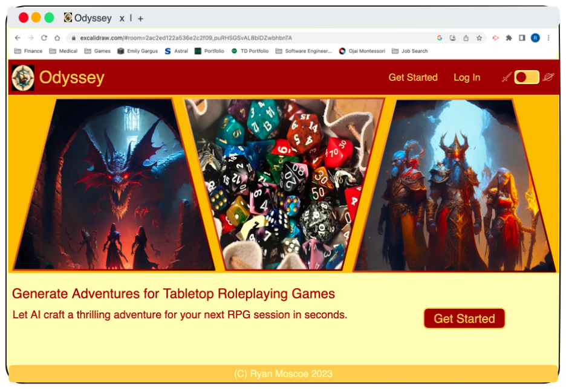
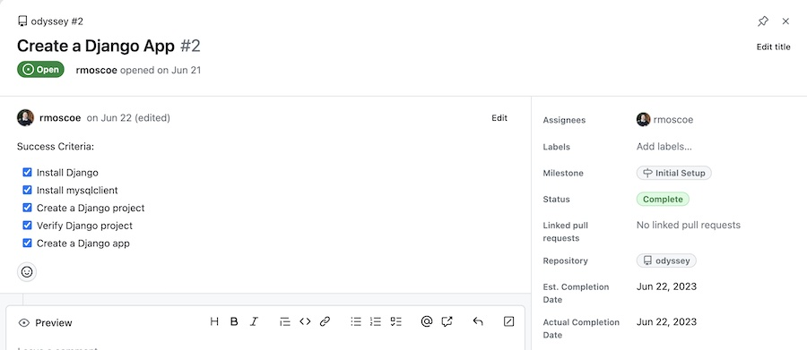

# Odyssey

## Table of Contents

- [Table of Contents](#table-of-contents)
- [Description](#description)
- [Technology Used](#technology-used)
  - [Badges](#badges)
- [Code Examples](#code-examples)
  - [Back End](#back-end)
  - [Front End](#front-end)
- [AI Prompt Example](#ai-prompt-example)
- [Usage](#usage)
  - [Getting Started](#getting-started)
  - [Logging In](#logging-in)
  - [My Adventures](#my-adventures)
  - [Generating an Adventure](#generating-an-adventure)
  - [Adventure Details](#adventure-details)
  - [Account Management](#account-management)
- [Process and Lessons Learned](#process-and-lessons-learned)
  - [Analysis and User Stories](#analysis-and-user-stories)
  - [Design, Technology Selection, and AI Prompt Development](#design-technology-selection-and-ai-prompt-development)
  - [Project Planning and Success Criteria](#project-planning-and-success-criteria)
  - [Development](#development)
- [Author Info](#author-info)
  - [Ryan Moscoe](#ryan-moscoe)
- [Features](#features)
- [Future Development](#future-development)
- [License](#license)
- [Contributing](#contributing)

<br/>

## Description 

[Visit the Deployed Site](https://odyssey-d4b3f26536d0.herokuapp.com/)

Writing adventures is time-consuming, and players often make unanticipated choices, forcing game masters to improvise and abandon the preparations they spent so much time creating. What game masters need is a way to create a customized adventure quickly.

Odyssey uses the Google PaLM2 generative AI to craft thrilling adventures for tabletop roleplaying games in seconds. Choose from a large selection of the most popular games, enter a lesser-known title, or describe an unpublished/homebrew game. Refine your request with a campaign setting, number of players, experience level, and other parameters.

If desired, fine-tune the adventure by editing it, then save it so you can refer to it over the course of multiple game sessions. View the details of any of your saved adventures, and edit saved adventures to adapt to your players' choices. Odyssey also tracks the group's progress through the adventure.

Odyssey is built with Python/Django for the back end and TypeScript, React, and TailwindCSS for the front end. It uses PaLM2 and Gencraft generative AIs, and it has a MySQL database.


_____

<br/>

## Technology Used 

| Technology  | Description                                                                                        | Resource URL                                                                                         |
| ----------- | -------------------------------------------------------------------------------------------------- | ---------------------------------------------------------------------------------------------------- |
| MySQL       | Relational database                                                                                | [https://www.mysql.com/](https://www.mysql.com/)                                                     |
| Python      | Programming language often used with AI and machine learning                                       | [https://www.python.org/](https://www.python.org/)                                                   |
| Django      | Web development framework for Python                                                               | [https://www.djangoproject.com/](https://www.djangoproject.com/)                                     |
| PaLM2       | Large language model (LLM) generative AI                                                           | [https://ai.google/discover/palm2/](https://ai.google/discover/palm2/)                               |
| Gencraft    | AI image generator                                                                                 | [https://gencraft.com/](https://gencraft.com/)                                                       |
| Vite        | Build tool that aims to provide a faster and leaner development experience for modern web projects | [https://vitejs.dev/](https://vitejs.dev/)                                                           |
| TypeScript  | Strongly typed variant of the JavaScript programming language                                      | [https://www.typescriptlang.org/](https://www.typescriptlang.org/)                                   |
| React       | Web interface library                                                                              | [https://react.dev/](https://react.dev/)                                                             |
| CSS         | Programming language for styling web pages                                                         | [https://developer.mozilla.org/en-US/docs/Web/CSS](https://developer.mozilla.org/en-US/docs/Web/CSS) |
| TailwindCSS | Utility-first CSS framework                                                                        | [https://tailwindcss.com/](https://tailwindcss.com/)                                                 |
| Git         | Version control system                                                                             | [https://git-scm.com/](https://git-scm.com/)                                                         |
| Github      | Development platform featuring remote repositories                                                 | [https://github.com/](https://github.com/)                                                           |
| Heroku      | Cloud platform as a service (PaaS)                                                                 | [https://www.heroku.com/home](https://www.heroku.com/home)                                           |

<br/>

### Badges

  &nbsp; &nbsp;     &nbsp; &nbsp;      &nbsp; &nbsp;     &nbsp; &nbsp;  

-----

<br/>

## Code Examples

### Back End

In Django, a view is an action or set of actions that occurs when a particular URL is accessed. The view below is triggered by a POST request to the `api/generate-adventure/` URL. The login_required_ajax decorator invokes a custom function to ensure the user is logged in before running the rest of the code.

```python
class GenerateAdventureView(APIView):
    @login_required_ajax
    def post(self, request):
        try:
            data = request.data
            campaign_setting = data.get("campaign_setting")
            level = data.get("level")
            experience = data.get("experience")
            context = data.get("context")

            adventure = generate_adventure(data["game"], data["players"], data["scenes"], data["encounters"], data["plot_twists"], data["clues"], campaign_setting, level, experience, context).strip('"```json\\n').rstrip('\\n```"')

            adventure_dict = json.loads(adventure)
            serialized_adventure = json.dumps(adventure_dict)

            return HttpResponse(serialized_adventure, content_type="application/json")
        except Exception as e:
            print("Unable to generate adventure because %s" % e)
            return Response({'error': 'Something went wrong when generating adventure'}, status=500)
```

<br/>

### Front End

The Adventure Details page includes the saveAdventure() function below. Saving changes to an adventure is a complex process, because the adventure includes certain details (e.g. a title and an exposition) but also has a one-to-many relationship with zero or more Scene objects. Each Scene, in turn, has a one-to-many relationship with zero or more Encounter objects. In addition, Scenes and Encounters can be added while editing the adventure. As a result, some scenes and encounters may already exist in the database, whereas others may not.

The saveAdventure() function sets the complex process of saving changes to an adventure (and its scenes and encounters) in motion.
1. It sets the `loading` state variable to true, which renders a spinner.
2. It validates the field values.
3. It assembles the payload for the API call to update the adventure in the database.
4. It makes an asynchronous call to the server (back end) to update the adventure in the database. In order to do so, it must pass a CSRF Token in the headers, which is a Django security measure.
5. It updates the `adventure` state variable so the adventure details can be rerendered with the updated values.
6. It sets the `saveScene` state variable to true. This variable is passed as a prop to the Scene components and causes each scene to invoke a function to save its updates to the database via a useEffect hook.

Similarly, When each scene completes its API call to update itself in the database, it sets a state variable that is passed as a prop to each Encounter object, causing each Encounter to save itself to the database. When each encounter completes its API call, it increments a state variable at the Scene level. Each Scene increments another state variable on the Adventure Details page when all encounters for that scene have been saved. The last Scene to report that all encounters have been saved resets the state variables involved in saving the adventure, scenes, and encounters. It also sets `loading` to false so the spinner is no longer rendered.

```typescript
    const saveAdventure = async () => {
        setLoading(true);

        // Validate
        setNotification("Validating");
        if (titleText === '') {
            setNotification("Title is required");
            titleInputRef.current?.classList.add("invalid-entry");
            setLoading(false);
            return;
        }
        if (expositionText.length > 499) {
            setNotification("Background exceeds character limit.");
            expositionRef && expositionRef.current?.classList.add("invalid-entry");
            setLoading(false);
            return;
        }

        // assemble Adventure
        setNotification("Saving adventure");
        const adventurePayload = {
            title: titleText,
            exposition: expositionRef.current?.innerText || expositionText,
            incitement: incitementText,
            climax: climaxText,
            denoument: denoumentText
        }

        try {
            // save Adventure
            const response = await axios.patch(`/api/adventures/${id}/`, adventurePayload, { headers: { 'X-CSRFToken': Cookies.get('csrftoken') } });

            if (response.status === 401) {
                navigate('/login');
            } else if (response.data) {
                setAdventure(response.data);
                setSaveComplete(false);
                if (scenes) {
                    resetScenesSaved();
                }
                setSaveScene(true);
            } else {
                setNotification('Oops! Something went wrong. Please try again.');
            }
        } catch (err) {
            console.error(err);
            setNotification("Oops! Something went wrong. Please try again.");
            setLoading(false);
        }
    }
```

Whereas the previous code example shows how certain functionality was achieved with TypeScript and React, the following example shows how a portion of the structure of the Adventure Details page was built with TypeScript and JSX, which is a syntax extension for JavaScript used for writing markup similar to HTML within a JavaScript (or TypeScript) file. This section of markup contains several noteworthy elements:
* The CSRFToken is a custom React component responsible for obtaining a CSRF Token from the server and storing it on the client side as a cookie. All mutating API requests (create, update, or delete) to a Django server must pass a CSRF Token.
* Other custom components shown include the Stage, Carousel, and SceneDetails components.
* Carousel functionality is particularly difficult to execute well. I tried three different libraries before finding success with react-responsive-carousel.
* The scenes array is mapped onto the SceneDetails component, so that one SceneDetails component is rendered for each scene in the adventure. Each SceneDetails component functions as a slide in the Carousel.

```html
    <section key={adventureKey} className="w-full px-2 space-y-3 lg:w-4/5 mx-auto">
        {edit &&
            <CSRFToken />
        }
        <Stage key="exposition" title="Background" content={exposition} edit={edit} setRef={setExpositionRef} inputText={expositionText} loading={loading} handleInputChange={handleInputChange} />
        <Stage key="incitement" title="Beginning" content={incitement} edit={edit} setRef={setIncitementRef} inputText={incitementText} loading={loading} handleInputChange={handleInputChange} />
        <div key={carouselKey} >
            <Carousel dynamicHeight={true} preventMovementUntilSwipeScrollTolerance={true} swipeScrollTolerance={edit ? 250 : 25} emulateTouch={!edit} centerMode={true} centerSlidePercentage={100} showStatus={false} showThumbs={false} onChange={handleSlideChange} selectedItem={activeScene} >
                {scenes?.map((scene, i) => (
                    <SceneDetails key={scene?.id || i} scene={scene} scenes={scenes} setScenes={setScenes} sceneIndex={i} edit={edit} handleDeleteClick={handleDeleteClick} startScene={startScene} completeScene={completeScene} startEncounter={startEncounter} completeEncounter={completeEncounter} loading={loading} setActiveScene={setActiveScene} deleting={deleting} setDeleting={setDeleting} sceneDelIdx={sceneDelIdx} setSceneDelIdx={setSceneDelIdx} reloadRequired={reloadRequired} setReloadRequired={setReloadRequired} carouselKey={carouselKey} setCarouselKey={setCarouselKey} removeScene={removeScene} setRemoveScene={setRemoveScene} adventureId={id} saveScene={saveScene} setNotification={setNotification} incScenesSaved={incScenesSaved} rerenderRequired={rerenderRequired} setRerenderRequired={setRerenderRequired} />
                ))}
            </Carousel>
        </div>
        <Stage key="climax" title="Climax" content={climax} edit={edit} setRef={setClimaxRef} inputText={climaxText} loading={loading} climax_progress={climax_progress} scenes_complete={scenes_complete} startClimax={startClimax} completeClimax={completeClimax} handleInputChange={handleInputChange} />
        <Stage key="denoument" title="Epilogue" content={denoument} edit={edit} setRef={setDenoumentRef} inputText={denoumentText} loading={loading} handleInputChange={handleInputChange} />
    </section>
```

-----

<br/>

## AI Prompt Example

Below is the prompt provided to Google PaLM2 to generate an adventure. The prompt always includes certain text but is also dynamically constructed based on user input. This prompt is an example of a zero-shot prompt, meaning it does not provide an example of an adventure for the AI to replicate, relying instead on instructions and context. The instructions take the form of a task input ("Write an adventure...").

The context for this prompt includes detailed instructions about how to format the response ("Respond in JSON using the following format..."), as well as contextual information ("The following is a description of {game}, a homebrew roleplaying game..." and "Each encounter is a trap, enemies, a puzzle... or some other obstacle.").

Not shown in the prompt itself are the parameters passed to PaLM2 to control how the model generates a response. In early tests, generated adventures tended to be almost identical, whith only slight variations. To make Odyssey more "creative," I ramped up the randomness by significantly increasing the temperate, top-k, and top-p values. The nature of roleplaying games means that adventures should contain some (**pretend**) violence and could contain (pretend) sexual content. Players are generally at least 12 years old, with the vast majority being adults or teenagers. Therefore, I also adjusted the safety settings to allow for violence and modest sexual content but prohibit derogatory, toxic, medical, or dangerous content.

```python
    prompt = f"""Write an adventure for the {game} roleplaying game, """
    
    if campaign_setting is not None:
        prompt += f"""{campaign_setting} campaign setting, """
    
    prompt += f"""for {players} players"""

    if level is not None:
        prompt += f""" at level {level}"""
    
    if experience is not None:
        prompt += f""" with {experience} experience points"""

    prompt += ". "
    
    if homebrew_description is not None:
        prompt += f"""The following is a description of {game}, a homebrew roleplaying game:
        {homebrew_description}
        """

    prompt += f"""The rising action should include {scenes} scenes. Each encounter is a trap, enemies, a puzzle (in which case, describe the solution), or some other obstacle. Respond in JSON using the following format:
    {{
        Exposition: "Background knowledge the players might possess, if any, or prologue. Use between 0 and 250 characters for the exposition.",
        Incitement: "The event that directly involves the players and starts the adventure",
        "Rising Action": [scene: {{
          challenge: "something the players must accomplish to get one step closer to their goal", 
          setting: "where the scene takes place, which should be more specific than the name of a city", 
          encounters: [
            {{
              type: "type", 
              description: "something or someone that stands in their way, which could be a trap, a puzzle, an enemy or enemies, or a combination thereof"
            }}
          ], 
          "plot twist": "An event or discovery that changes something the players believed to be true", 
          clue : "a hint about what the players should do next or information that brings the players closer to completing the overall adventure"
        }}],
        Climax: "The final and most difficult scene that determines whether the players complete the adventure",
        Denoument: "Epilogue or rewards the players can expect if successful"
    }}

    Each scene has a challenge and an array of encounters. Each array of encounters includes a different random number of encounters, between 1 and {encounters} (inclusive). Also, {null_plot_twists}% of plot twists are null and {null_clues}% of clues are null. For example, one scene may have 3 encounters, a plot twist, and a null clue. Another scene may have 1 encounter, a null plot twist, and a clue."""

    if context is not None:
        prompt += "\n" + context
```

-----

<br/>

## Usage 

### Getting Started

The first time you visit Odyssey, you'll need to create an account in order to use any features of the application. The image below shows the Home page. To get started, click the `Get Started` link in the header (large screens only) or the `Get Started` button beneath the hero image.


On the Create an Account page, enter your email address, choose a password, and re-enter the password for confirmation (see below). Your password must contain at least 8 characters, including at least one lowercase letter, at least one uppercase letter, and at least one number.


**PLEASE NOTE** there is ***no guest/visitor/test account***. Because users can change the email address and password for an account, there is no way to ensure the accuracy of credentials provided for a guest account. Please create an account if you wish to explore the application.


<br/>

### Logging In

As a returning user, you must log in to use any features of the application. See the login page below. Enter your email address and password to log in.


If you forget your password, click the `Forgot Password?` link. The image below shows the Reset Password page, where you can enter your email address. Odyssey will send you an email with a link to reset your password. If you don't see the email in your inbox within a few minutes, make sure to check your spam folder.


Clicking the link in the password reset email will take you to the Set New Password page (see below). Enter a new password and re-enter it to confirm.


<br/>

### My Adventures

The My Adventures page is the landing page once you are logged in. It shows your existing adventures and acts as the gateway to creating a new adventure, accessing the details of an existing adventure, or deleting an adventure. As shown below, this page is empty until you create an adventure.


<br/>

### Generating an Adventure

To begin, click the `New Adventure` button on the My Adventures page. On the New Adventure page (see below), enter the parameters for your adventure, such as the game for which you want an adventure and the number of players. Fields marked with an asterisk (*) are required.


For your convenience, Odyssey lets you select a game from a list of the most popular tabletop roleplaying games, but you are not limited to these titles. Selecting `Other` lets you enter the name of another game. One of Odyssey's best features is its ability to generate adventures for unpublished, homebrew games. As shown below, just enter a description of the game.


The AI requires a few seconds to generate an adventure for you. Once the adventure is generated, it will be shown below the form (small screens) or to the right of the form (large screens). If you're happy with the adventure, give it a title and click the disk (&#x1F4BE;) button to save. 


Even if you're not completely happy with the generated adventure, it may inspire your creative juices. If so, click any of the pencil (&#x270E;) icons to edit a specific part of the adventure (see below). Alternatively, you may click a plus (+) buttons to add a scene or (in scene edit mode) an encounter, or click any of the trash can (&#x1F5D1;) buttons to delete a specific part of the adventure. ***Don't forget to give your adventure a title and save it when you're finished editing.***


Finally, you always have the option to fill out the form again and generate a totally different adventure. After saving an adventure, you have the option to return to the My Adventures page, view the details of the new adventure, or generate another adventure.

<br/>

### Adventure Details

During gaming sessions, use the Adventure Details page to see the plot of the adventure and track the group's progress through it. You can also edit the adventure if the group makes choices that change the storyline or you just want to add an extra challenge, remove something, or change some details. You can access an adventure's details immediately after saving the newly generated adventure or by clicking the adventure's tile on the My Adventures page (see below).


The narrative structure of an adventure consists of five parts:
1. Exposition (Background section), which includes background information.
2. Incitement (Beginning section), an event that sets the story in motion.
3. Rising action, which consists of one or more scenes, each including one or more encounters. Dramatic tension rises toward the climax.
4. Climax, the pivotal moment when dramatic tension is at its highest and the outcome of the adventure is determined.
5. Denoument (Epilogue), in which the dramatic tension is dispersed and the heroes are (usually) rewarded.


Progress bars indicate the status of the adventure as well as each scene and encounter. Completed scenes are also greyed out. Track the group's progress through the adventure:
* When a scene is available to start, it will have a `Start` button in the bottom-right corner. The first scene is available immediately; each subsequent scene becomes available when the previous scene is completed.
* When an encounter is available to start, it will have a `Start` button as well. The first encounter in each scene is available once the scene has started. Each subsequent encounter in that scene is available when the previous encounter is completed.
* When the group finishes an encounter, click the `Complete` button for that encounter to mark it complete.
* When the group finishes the last encounter in a scene, you may mark the scene complete, or you can hold off if there are still other activities happening within the scene (such as conversations, travel, etc.).
* The Climax becomes available when the last scene is completed.
* Marking the Climax complete brings the progress of the adventure to 100%.

You can also click the pencil button to edit the adventure or the trash can button to delete it. If you edit the adventure (see below), click the disk button to save your changes when you're finished.


<br/>

### Account Management

You can change your email address or password any time by clicking the `Account Settings` link in the header (or hanburger menu on a small screen). The Account Settings page is shown below. Enter an email address and/or password to update your account. If you enter a new password, re-enter the new password to confirm.


<br/>

-----

<br/>

## Process and Lessons Learned 

### Analysis and User Stories

A typical analysis process involves gathering requirements from stakeholders. Because Odyssey is a personal portfolio project, there were no customers or business unit leaders to consult. Fortunately, I am an avid gamer, so I established requirements for the application based on my own experience as a tabletop RPG game master.

I wrote these requirements as user stories in my design document. I created a total of 18 user stories, from which I selected 14 for inclusion in the minimum viable product (MVP). Two examples of these user stories follow:
| As a {role} | I want {feature} | so that {reason} | What does it inform |
| ----- | ----- | ----- | ----- |
| User | To create a new adventure for a game of my choice | I can dazzle my players in a tabletop RPG with minimal investment of time and effort. | CLIENT: Need a create button, a form to collect specifications, and a new adventure page to show the new adventure.<br/>SERVER: Need a route to the form, a controller to submit the form and generate an adventure through the PaLM 2 API, and a route to the new adventure page. |
| User | To track progress in an adventure | Remember what happened in the previous session and where the group left off. | CLIENT: Need progress indicators for the adventure and each scene, plus a way to start and end each encounter and scene.<br/>SERVER: Need controllers to update encounters, scenes, and the adventure with the current progress.<br/>DB: Adventure, scene, and encounter models need progress fields. |

<br/>

### Design, Technology Selection, and AI Prompt Development

I began the design process with a project description before defining my data models and the relationships among the models. The schema design included five models: User, Adventure, Scene, Encounter, and Custom_Field. Defining these models presented the first major decision for this project: in order to identify the necessary fields for the adventure model, I needed to know which narrative structure I would use for the adventures. Some roleplaying games include suggestions about how to structure adventures. For example, Palladium games such as Rifts recommend a "Hook, Line, and Sinker" structure. 

To make this decision, I asked ChatGPT and Google Bard to write some adventures using various narrative structures. Based on these preliminary results, I selected a version of Freytag's Pyramid that included the five elements described above in [Adventure Details](#adventure-details): exposition, incitement, rising action, climax, and denoument.

Next, I defined the necessary URL patterns for the application, including the routes for rendering the views as well as the RESTful API that would be responsible for transporting data between the client, server, and database and performing Create, Read, Update, and Delete (CRUD) operations.

From there, I designed the appearance of the application. Rather than simple wireframes, I created full-fledged designs for the mobile and desktop versions of each page using [Excalidraw](https://excalidraw.com/), complete with a list of font selections and hexadecimal color codes. I did not want to have to worry about these choices later, when I would need to focus on writing the code. I used a mobile-first approach, designing the mobile version of each page first and only then designing the desktop version. As an example, consider the following images:
1. My design for the mobile version of the Home page
2. My design for the desktop version of the Home page
3. The actual desktop version of the Home page

<br/>
Design for the mobile version of the Home page

<br/>



<br/>


<br/>

In order to achieve these designs, I used the Gencraft AI image generator to create the central portion of the logo (the ship in heavy seas). I created the compass rose for the logo background myself. I also used Gencraft to create images for the hero section of the homepage. I selected Gencraft after feeding identical prompts to several AI image generators. Not only did Gencraft produce the best results, but its free tier had a generous allotment of prompts and images. Successful prompts included the following:
* `A favicon depicting an epic voyage`
* `medieval adventurers in a dungeon with a large, scaly, maroon dragon approaching from the darkness`
* `starfighters shooting lasers at each other in celestial space`
* `the control room of a space battleship`

Using AI to generate images for Odyssey led to the first of many lessons learned:

>AI is not yet very good at drawing figures.

Consider the following prompts:
* `medieval wizard, elf, dwarf, and warrior in a castle parapet with a single maroon dragon flying in the background`
* `a hooded elf on a castle parapet with a deep red dragon flying in the background`

The AI had a tendency to draw the humanoid figures with extra limbs (or too few). As for the dragon... Many of the results looked like chunks of dragon littering the sky: a talon here, a wing there, and bits of scaly flesh all over the place.

The final step in the design process was to select technologies. In selecting a generative AI technology, I considered two primary factors: quality and cost. I would have liked to consider ease of use as well, but this was my first foray into AI technologies, so I didn't have a basis for comparison. After studying Googles documentation on prompt design, I crafted a prompt to generate an adventure and compared results from ChatGPT and Google Bard. I refined the prompt several times to try to improve my results, but I also used this process to evaluate the quality of the leading AI tools. In the end, Bard had a slight edge in quality--and a massive lead in cost. As of now, Google's PaLM2 is still free, and even when they start charging for it, the cost will be approximately 1/7 the cost of GPT. With a single winner in both quality and cost, the choice was clear.

My database needs were minimal, and I could have used pretty much any database technology. I knew I was electing to learn a lot of new technologies for this project already, so I chose to stick with something familiar for the database, which meant MySQL or MongoDB. The choice of MySQL over MongoDB was somewhat arbitrary.

Python was a natural choice for the back end because of its strong association with AI and machine learning. Google's PaLM2 even has a client for Python (and only for Python). I had previously used Flask with Python, but Django seemed to be a more marketable skill than Flask, so I chose to use Django for this project.

For the front end, I knew I wanted to learn TypeScript and TailwindCSS, because they seemed to be in-demand skills. After confirming that TypeScript was compatible with React, I finalized the decision to use those technologies. 

The only remaining question was how to deploy Odyssey. I had experience with Heroku, but that experience could not be characterized as positive. I had also used AWS, but not successfully. My research uncovered several other platforms that had much better reviews than Heroku, but they were also considerably more expensive. I couldn't justify spending that kind of money on a portfolio project, especially when I had not personally tried the technology to make sure it was as user-friendly as people were claiming. In addition, I was already going to have to learn Django, the Google PaLM2 Python client, TypeScript, and TailwindCSS for this project. So I ultimately decided to stick with "the devil I knew" and chose Heroku for deployment.

<br/>

### Project Planning and Success Criteria

I used GitHub Projects to create a project plan I created a GitHub issue for each task and milestone. I also created a custom set of statuses to accurately reflect my workflow:
* Backlog
* User Stories
* To Do
* In Progress
* Testing
* Complete

At the "User Stories" stage for each task, I added success critera to the underlying GitHub issue (see the example below).



After 13 years in the Talent Development field, I have enough experience with project management that planning the Odyssey project went smoothly and didn't yield any real lessons for me.

<br/>

### Development

#### Bootstrapping and Delpoyment

Before writing any code, I began by watching a couple of video tutorials on Django. Then I dove into the Django documentation and bootstrapped a Django project with `django-admin startproject odyssey`. Little did I know that creating Odyssey would, itself, be an odyssey.

My approach was to bootstrap all the components (Django project, React project, and Heroku deployment) first, then stitch them together before writing any code. I recognized that it would never be easier to link the components and debug any issues than in the beginning, before I introduced any confounding variables by adding application code. In retrospect, this was absolutely the right approach.

Right away, I noticed that `create-react-app` had recently been deprecated. But it still seemed to work, and with everything else I was already actively learning, I didn't want to take on a whole new tool like NextJS or Vite, so I decided not to worry about it.

In short order, I had a Django development server, a React project, and a Tailwind build, but then I hit a snag. Django has excellent documentation for how to serve Django templates, but it is completely silent on how to serve a React front-end (or any other non-Django front-end). After some Google sleuthing, I had a solution that seemed to be working, so I started preparing for deployment by installing Green Unicorn (which runs a production server in place of Django's "runserver" development server), creating a Heroku application, and provisioning it with a JawsDB MySQL database. After several hours of wrestling with Heroku, I could not get it to work and I had run out of things to try. I opened a support ticket, but it was the end of the day on a Friday. I considered switching to a different platform or scrapping the project, but the following Monday, Odyssey was live on Heroku (even though I had not made any changes or attempted to deploy again since Friday).

<br/>

#### Database and Server

The data model for Odyssey is pretty simple, and I had no trouble creating Django models, making migrations, or migrating to create a local database for development. I elected to use Django's built-in authentication system for two reasons: (1) I already had some experience with authentication, and I wanted to use this project to learn other things. (2) Django was one of those other things I wanted to learn, so it made sense to use as many built-in features of Django as possible. However, in order to do so, I needed to understand Django's User model, and it was not easy to find information about the User model in the documentation. 

With the models in place, I turned my attention to creating the routes. I was familiar with the Model-View-Controller (MVC) design pattern, in which the View layer consists of the front end of the application--everything the user *sees*. This is a perfectly apt name, because of the relationship between the words *see* and *view*. Since I was using TypeScript/React, rather than Django templates, for the front end, I skipped the section in the Django documentation on the View layer, which led to my next major lesson learned.

I had great difficulty figuring out how to create routes in Django. I eventually had to turn to Google and ChatGPT to ask how to create a REST API in Django. The answer I found was a separate library called Django REST Framework (DRF). In and of itself, there is nothing wrong with using DRF. It was easy to learn, and it simplifies the creation of an API through the use of ViewSets, which include some cookie-cutter patterns out of the box that just work, without the need for any application code.  However, by the time I was about half-way through the construction of the API, I realized that DRF was not actually necessary:

> Django uses the term *View* to refer to the code that executes when a request is made to a particular URL. A Django View is an MVC Controller.

At that point, I was far enough along that there was no reason to start over and use Django views, so I continued building the API with DRF ViewSets. But I could have saved myself some trouble by reading the View Layer section of the Django documentation.

Along with the views for CRUD functions on my models, I created a view to interface with PaLM2's Python client and generate an adventure. I had already developed and refined the prompt, but I needed to parameterize it to incorporate user input.

Once my models and views were complete, I tested all of my routes and CRUD functionality using [Insomnia](https://insomnia.rest/). Almost everything worked flawlessly in these early tests, but I learned one more important lesson:

> PUT requests require a complete record. To update only certain fields in a record, you have to use a PATCH request. Unfortunately, DRF doesn't accommodate PATCH requests out of the box, so I had to write partial_update view functions for each model before proceeding.

<br/>

#### Client

I began development on the client side by setting up Tailwind. I followed the instructions in the documentation to the letter, but the build was not successful. I assumed that since the project was brand new, the build failed because there was nothing to build yet. Therefore, I moved on to configuring my theme styles in the Tailwind config file, building out the top-level React files (index.tsx, App.tsx), creating a theme context, and creating my first few React components.

Initially, my progress was fairly quick, and I was ahead of schedule. Once I had enough components to complete the homepage, I was able to test it, and that's when things started to fall apart. Tailwind was not working at all, and I was having a variety of other issues I could not explain. To rule out any issues related to the deprecation of create-react-app, I decided to start over on the client. So I took a step back and evaluated the options, settling on Vite.

After watching a tutorial video on Vite, I set up a Vite/TypeScript/React project and then added Tailwind to it. However, once again, the instructions in Tailwind's documentation did not work. Vite created a slightly different temporary homepage than create-react-app had, which allowed me to discover another, far more serious issue: my Django back end was not actually serving my React app.

I exhausted every resource I could find online but could not find a way to get Django to serve a React app. So I decided it was time to hire a tutor. I found many tutors with experience in both Django and React, but very few in my price range who had used them together. The tutor I hired was unable to figure out the cause of the issue, and the other tutors I approached said they didn't have enough experience using Django with React to be able to help me. At that point, I thought I was going to have to abandon the project or convert my back end to NodeJS, but I had a breakthrough just two days later:

> Django was trying to serve the static output files from my React build process from the wrong directory. Instead of serving from the STATIC_ROOT directory (where static files are collected), it was serving from STATICFILES_DIRS (which is where Django is supposed to look for static files to collect in STATIC_ROOT).

As a result, the paths to various assets were incorrect. However, attempting to change my Django settings caused errors. I opened a ticket with Django, but they summarily closed it, which meant this issue was not going to be fixed. Once again, I feared I would have to abandon the project or rewrite the back end in NodeJS. A couple days later, however, I came up with a workaround: I created a custom build script that ran the Vite build process and then copied the output files from the /dist directory to a separate /static directory and set that as my STATIC_ROOT. That resolved the issue.

I had saved my original front end files in a different directory. The file structure had changed somewhat from create-react-app to Vite, but I was able to copy my code into the new files so I didn't lose all that work. Tailwind still was not working, however. I found a video tutorial on Tailwind that provided instructions completely different from the Tailwind documentation, and those instructions finally got Tailwind to complete a successful build. But no matter what I did, Tailwind never created classes for any of the styles I had defined in the Tailwind config file. I finally had to resort to creating my own CSS classes. I learned another lesson from this experience:

> Don't use TailwindCSS. The setup instructions in Tailwind's documentation are incorrect, and Tailwind doesn't create classes for custom styles. But even if Tailwind had done exactly what it was supposed to do, its "utility-first" philosophy meant that I had to assign the same Tailwind utility classes to inumerable HTML elements--and if I wanted to change something later, I would have to find and change that class on every element that used it.

I continued to develop the client but ran into another issue two days later. After completing the Reset Password page and Set New Password page, all my tests were unsuccessful. I kept getting 403 (Forbidden) errors related to something called a CSRF Token. Once again, the Django documents offered a very clear explanation of how a Django template could receive a CSRF token and pass it back with every mutating (POST, PATCH, DELETE) request, but the docs were silent on how a React app could accomplish the same thing. Eventually, I found a helpful video tutorial that explained how a React app could obtain a CSRF token, and I was able to piece together how I could pass it back to the server. Lesson learned:

> A CSRF Token is a security measure specific to Django (although similar functionality can be implemented without Django). To use a CSRF token without using Django's template engine...
> 1. Create a Django url pattern to get a CSRF Token.
> 2. Create a Django view with an `@method_decorator()` decorator, and pass the `ensure_csrf_cookie` function to the decorator. A request to that url thus returns a CSRF Token.
> 3. Create a React component that consists of a hidden input element. Give it a useEffect hook that sends a GET request to the CSRF Token URL, thus retrieving a CSRF Token, and then saves the CSRF Token as a cookie. Include this component on any page that submits mutating queries.
> 4. Retrieve the CSRF cookie and send it with each mutating query.

Once I resolved the CSRF Token issue, I was able to submit mutating queries. That allowed me to test the login process, which led to another major lesson:

> The Django built-in authentication system is largely incompatible with a non-Django front end. 

In order make authentication work, I had to develop custom versions of most authentication functionalities, including a `@login_required` decorator, a Create User view, a Login view, a User Partial Update view, and a Logout view. I also had to create an additional model in my database for a session token.

I continued developing components and pages, but then I started a new job the day after my birthday, so about a week went by without any progress. When I fired up the development server after that week, the CSRF Token was no longer working--even though it had been working before and nothing had changed in my code. I eventually got that resolved and continued development. I was in the middle of developing the New Adventure page when mysqlclient suddenly and inexplicably quit working. Nothing I tried resolved the issue, and I was eventually forced to replace mysqlclient with mysql-connector-python. Around that same time, I started getting notifications that deployments to Heroku were failing, but I suspected the notifications were invalid at the time because Odyssey was still live on Heroku.

Soon after that, I learned another difficult lesson:

> Carousels are really difficult to implement. I went through three different libraries before finding success with react-responsive-carousel.

The last page I needed to build was Adventure Details. Shortly after I started building the Adventure Details page, I learned one final lesson:

> Never, ever use Heroku. I realized that even though Odyssey was still up and running on Heroku, deployments were in fact failing, so the application was not being updated. When I dug deeper into the failed deployments, the logs showed the failures were related to mysqlclient, which was very bizare, because I had removed mysqlclient from my application and replaced it with mysql-connector-python. But when I opened the Heroku console and inspected the requirements.txt file, it still listed mysqlclient. No matter what I did, I could not replace mysqlclient with mysql-connector-python on Heroku. Even when I edited the requirements.txt file on Heroku, saved the changes, and reopened it, it reverted to mysqlclient. Ultimately, I was forced to set up the application to use mysqlclient on Heroku and mysql-connector-python locally.

-----

<br/>

## Author Info

### Ryan Moscoe 

* [Portfolio](https://rmoscoe.github.io/my-portfolio/)
* [LinkedIn](https://www.linkedin.com/in/ryan-moscoe-8652973/)
* [Github](https://github.com/rmoscoe)

-----

<br/>

## Features

* User authentication
* User account management
* AI adventure generation
* Persistent adventures
* Adventure editor
* Adventure deletion
* Fantasy (light) and Sci-Fi (dark) themes

Instead of generic light and dark themes, Odyssey offers a fantasy theme with dark text against a light background and a sci-fi theme with light text against a dark background.

<br/>

<br/>
Fantasy theme

<br/>

<br/>
Sci-fi theme

-----

<br/>

## Future Development

Because this is a portfolio project, there are no concrete plans for additional development. However, if and when time allows, I might periodically add features or fix bugs. Four of my original user stories did not make it into the MVP, and additional ideas might arise over time. Examples of features that ***may*** be added over time include
* The ability to archive adventures. Only active adventures would appear on the My Adventures page, but archived adventures could still be accessed on a separate archive page.
* Having the AI generate stats for each encounter. Currently, it generates only descriptions, and it may not be possible for the AI to reliably generate stats for encounters without training a custom model, which is beyond the budget and scope of this project. Obstacles include inconsistent game systems, constraining difficulty to the players' experience level/point range, and varying the difficulty level in a generally increasing direction throughout the course of the adventure. But if time permits, I would like to at least try to make this happen.
* AI-generated assets for adventures, such as maps, diagrams, character images, etc.
* Permit users to add custom fields to adventures, scenes, and encounters. This would allow users to customize not only the content, but the format of their adventures. The data model and views for custom fields are already built, but the fields themselves have not yet been implemented.
* The ability to delete a user account.
* The ability to share adventures with other users.
* The ability to have the AI generate a single scene or encounter on the fly. Cost efficiency is a constraint on this feature. The AI would need access to the entire adventure as context, which would make for a large (and thus, expensive) prompt.
* The incorporation of machine learning to allow users to give the AI feedback on the adventures it generates (e.g., thumbs and/or a limited number of simple statements like "too difficult", "too easy", etc.).
* Continued refinement of the main prompt to improve the reliability and quality of responses and/or the efficiency of the prompt.
* Additional content on the Home page showing the features of the application and providing some simple instructions.

-----

<br/>

## License

This project uses the [MIT License](https://choosealicense.com/licenses/mit/). See repository for license details.

-----

<br/>

## Contributing

Because this is a portfolio project, I am not accepting contributions at this time.